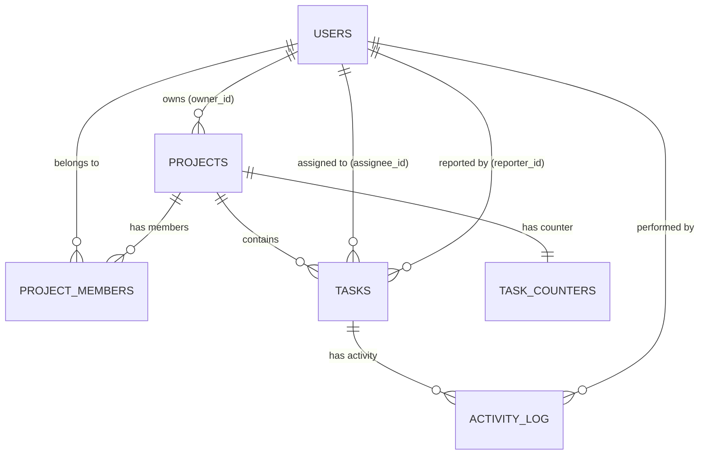

# Database Schema Documentation

This document explains every table, column, relationship, and design decision in the TaskTrack PostgreSQL schema.

SQL file: [schema.sql](file:///Users/cherry/Assignment/backend/src/config/schema.sql)

---

## Entity-Relationship Diagram



---

## Tables Overview

| Table | Purpose | Frontend Screen |
|---|---|---|
| `users` | Authentication, profiles, role-based access | AuthScreen, ProfileScreen, UsersScreen, Avatar components |
| `projects` | Project metadata and ownership | ProjectsDirectory, ProjectScreen header |
| `project_members` | Many-to-many: which users belong to which projects | AvatarStack on project cards, "Add member" button |
| `tasks` | Core work items with status/priority/labels | KanbanBoard, TaskCard, TaskModal, Dashboard, MyTasks |
| `task_counters` | Per-project auto-increment for task keys (WEB-1, WEB-2…) | Task key display everywhere |
| `activity_log` | Audit trail: status changes, comments, reassignments | TaskModal activity section, Dashboard "Recent activity" |

---

## Detailed Table Descriptions

### 1. `users`

The foundation table. Every person who signs up gets a row here.

| Column | Type | Purpose |
|---|---|---|
| `id` | UUID (PK) | Primary key, auto-generated |
| `name` | VARCHAR(100) | Full name — displayed in Avatar, task cards |
| `email` | VARCHAR(255) UNIQUE | Login credential, shown in UsersScreen |
| `password_hash` | VARCHAR(255) | bcrypt hash — never stored in plain text |
| `role` | ENUM (`admin`, `member`) | **Role-Based Access Control** — Admins can create projects, delete tasks, manage users; Members can only view/update their assigned tasks |
| `initials` | VARCHAR(5) | Derived from name (e.g. "AM"), used by Avatar component |
| `avatar_color` | VARCHAR(7) | Hex color for the avatar circle |
| `job_title` | VARCHAR(100) | ProfileScreen "Role" field |
| `phone` | VARCHAR(20) | ProfileScreen contact info |
| `location` | VARCHAR(100) | ProfileScreen contact info |
| `timezone` | VARCHAR(50) | ProfileScreen contact info |
| `bio` | VARCHAR(240) | ProfileScreen "About" section (max 240 chars) |
| `created_at` | TIMESTAMPTZ | Auto-set on insert |
| `updated_at` | TIMESTAMPTZ | Auto-updated via trigger |

> [!IMPORTANT]
> The `role` column is **system-wide**. An `admin` has elevated privileges across all projects. This is simpler than per-project roles and appropriate for the 1-2 day assignment scope.

---

### 2. `projects`

Each project is a container for tasks and a team of members.

| Column | Type | Purpose |
|---|---|---|
| `id` | UUID (PK) | Primary key |
| `name` | VARCHAR(150) | Displayed as the project card title |
| `key` | VARCHAR(10) UNIQUE | Short code like `WEB`, `MOB` — used as prefix for task IDs |
| `description` | TEXT | Shown on project cards and project detail header |
| `color` | VARCHAR(7) | Hex color for the project badge icon |
| `owner_id` | UUID (FK → users) | The admin who created this project |
| `created_at` | TIMESTAMPTZ | Auto-set |
| `updated_at` | TIMESTAMPTZ | Auto-updated via trigger |

> [!NOTE]
> The `key` column must be unique and uppercase (enforced in the API layer). It's used to auto-generate task keys like `WEB-12`.

---

### 3. `project_members` (Join Table)

This is the **many-to-many** bridge between `users` and `projects`.

| Column | Type | Purpose |
|---|---|---|
| `id` | UUID (PK) | Primary key |
| `project_id` | UUID (FK → projects) | Which project |
| `user_id` | UUID (FK → users) | Which user |
| `joined_at` | TIMESTAMPTZ | When the member was added |

**Constraint**: `UNIQUE (project_id, user_id)` — prevents adding the same member twice.

**Relationship**:
- A **user** can be a member of **many projects** (1:N from user side)
- A **project** can have **many members** (1:N from project side)
- Together this creates an **M:N relationship**

---

### 4. `tasks`

The core entity of the application. Every task card on the Kanban board is a row in this table.

| Column | Type | Purpose |
|---|---|---|
| `id` | UUID (PK) | Primary key |
| `key` | VARCHAR(20) UNIQUE | Human-readable ID like `WEB-12` — displayed on every task card |
| `title` | VARCHAR(255) | Task name — displayed as the card title |
| `description` | TEXT | Detailed info — shown in the TaskModal left column |
| `status` | ENUM (`todo`, `in_progress`, `done`) | Maps to the 3 Kanban columns |
| `priority` | ENUM (`high`, `medium`, `low`) | Shown as colored arrows on task cards |
| `due_date` | DATE | Displayed on cards; turns red when overdue |
| `labels` | TEXT[] | Postgres array — displayed as badges (e.g. "design", "frontend") |
| `project_id` | UUID (FK → projects) | Which project this task belongs to |
| `assignee_id` | UUID (FK → users, nullable) | Who is working on this task |
| `reporter_id` | UUID (FK → users, nullable) | Who created/reported this task |
| `created_at` | TIMESTAMPTZ | Auto-set |
| `updated_at` | TIMESTAMPTZ | Auto-updated via trigger |

> [!TIP]
> `labels` uses Postgres native array type (`TEXT[]`) instead of a separate join table. This keeps queries simple (e.g. `WHERE 'design' = ANY(labels)`) and avoids extra joins for a simple tagging feature.

---

### 5. `task_counters`

A utility table to generate sequential task keys per project.

| Column | Type | Purpose |
|---|---|---|
| `project_id` | UUID (PK, FK → projects) | One counter per project |
| `last_number` | INT | The last assigned number (e.g. `12` means the next task will be `WEB-13`) |

**How it works** (in the API layer):
```sql
-- When creating a task in project "WEB":
UPDATE task_counters SET last_number = last_number + 1 WHERE project_id = $1 RETURNING last_number;
-- Returns 13 → task.key = "WEB-13"
```

---

### 6. `activity_log`

An append-only audit trail. Every status change, comment, or reassignment is logged here.

| Column | Type | Purpose |
|---|---|---|
| `id` | UUID (PK) | Primary key |
| `task_id` | UUID (FK → tasks) | Which task this activity is about |
| `user_id` | UUID (FK → users) | Who performed the action |
| `action` | VARCHAR(50) | Type: `status_change`, `comment`, `assignee_change`, `created` |
| `content` | TEXT | Human-readable summary or the comment body |
| `details` | JSONB | Structured metadata, e.g. `{"from": "todo", "to": "in_progress"}` |
| `created_at` | TIMESTAMPTZ | When the action happened |

> [!NOTE]
> Using `JSONB` for `details` gives us flexibility to store different shapes of data for different action types without adding columns.

---

## Relationships Summary

```
users ──┬──< project_members >──── projects
        │                              │
        │                              │
        ├── (assignee_id) ──< tasks >──┘
        │                      │
        ├── (reporter_id) ─────┘
        │                      
        └── (user_id) ──< activity_log >── tasks
```

| Relationship | Type | ON DELETE |
|---|---|---|
| `projects.owner_id` → `users.id` | Many-to-One | CASCADE (delete user → delete their projects) |
| `project_members.project_id` → `projects.id` | Many-to-One | CASCADE (delete project → remove memberships) |
| `project_members.user_id` → `users.id` | Many-to-One | CASCADE (delete user → remove memberships) |
| `tasks.project_id` → `projects.id` | Many-to-One | CASCADE (delete project → delete its tasks) |
| `tasks.assignee_id` → `users.id` | Many-to-One | SET NULL (delete user → unassign tasks) |
| `tasks.reporter_id` → `users.id` | Many-to-One | SET NULL (delete user → keep task, null reporter) |
| `activity_log.task_id` → `tasks.id` | Many-to-One | CASCADE (delete task → delete its activity) |
| `activity_log.user_id` → `users.id` | Many-to-One | CASCADE (delete user → delete their activity) |

---

## How This Maps to Assignment Requirements

| Requirement | How the Schema Satisfies It |
|---|---|
| **Authentication (Signup/Login)** | `users` table with `email`, `password_hash`. JWT tokens are stateless (no sessions table needed). |
| **Project & team management** | `projects` + `project_members` join table. Admins create projects and add members. |
| **Task creation, assignment & status tracking** | `tasks` table with `status` enum, `assignee_id` FK, `priority` enum, `due_date`. |
| **Dashboard (tasks, status, overdue)** | Query `tasks` with `WHERE assignee_id = $1`, aggregate by `status`, filter `WHERE due_date < NOW()` for overdue. |
| **REST APIs + Database** | Raw SQL via `pg` pool — direct Supabase Postgres connection. |
| **Proper validations & relationships** | ENUM types, UNIQUE constraints, FK constraints with appropriate ON DELETE behavior. |
| **Role-based access control** | `users.role` ENUM (`admin`/`member`) checked in Express middleware. |
