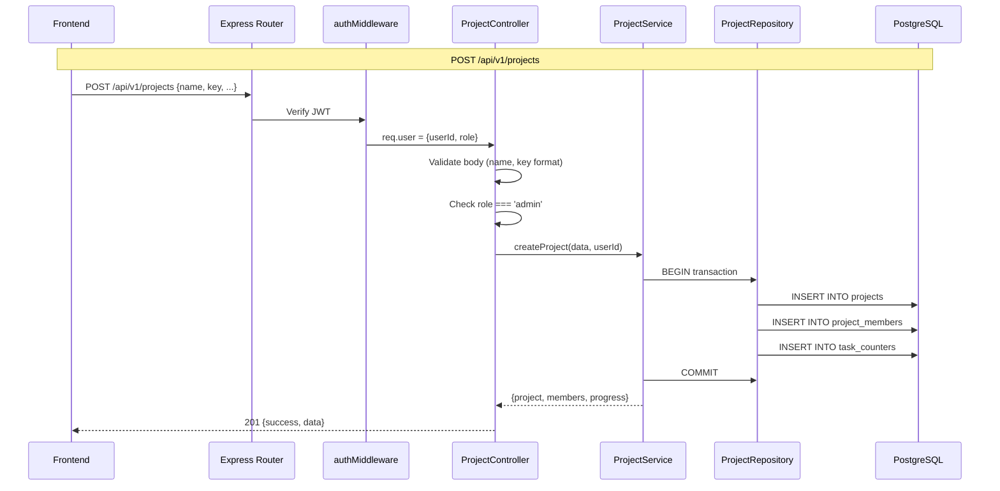

# Projects API — Complete Documentation

This document covers every detail you need to implement the Projects API endpoints: routes, request/response contracts, validations, SQL queries, RBAC rules, and the layered architecture (Controller → Service → Repository).

---

## Route Registration

```
Base path: /api/v1/projects
```

All project routes require authentication via the `authMiddleware`. Register in [app.js](file:///Users/cherry/Assignment/backend/app.js):

```js
import projectRoutes from "./src/routes/projectRoutes.js";
app.use("/api/v1/projects", projectRoutes);
```

> [!WARNING]
> Your current [projectRoutes.js](file:///Users/cherry/Assignment/backend/src/routes/projectRoutes.js) has `import React, { Router } from "react"` — this is a copy-paste error. It should be `import { Router } from "express"`. Also, the import paths are missing `.js` extensions which are required for ES modules.

---

## Endpoints Overview

| Method | Path | Auth | Role | Description |
|--------|------|------|------|-------------|
| `GET` | `/api/v1/projects` | ✅ Required | Any (admin or member) | Get all projects the user belongs to |
| `POST` | `/api/v1/projects` | ✅ Required | **Admin only** | Create a new project |
| `GET` | `/api/v1/projects/:id` | ✅ Required | Project member | Get single project with members & task stats |
| `PUT` | `/api/v1/projects/:id` | ✅ Required | **Admin only** | Update project name/description/color |
| `DELETE` | `/api/v1/projects/:id` | ✅ Required | **Admin (owner)** | Delete a project and all its tasks |
| `POST` | `/api/v1/projects/:id/members` | ✅ Required | **Admin only** | Add a member to the project |
| `DELETE` | `/api/v1/projects/:id/members/:userId` | ✅ Required | **Admin only** | Remove a member from the project |

> [!IMPORTANT]
> For the core assignment requirements, focus on **GET /** and **POST /** first. The other endpoints (PUT, DELETE, members) are stretch goals that will impress reviewers.

---

## 1. GET `/api/v1/projects` — List Projects

### Purpose
Returns all projects the authenticated user is a member of. Admins see all projects; Members see only projects they've been added to. Each project includes its task progress stats (done/total) and the list of members — this is exactly what the [ProjectsDirectory](file:///Users/cherry/Assignment/frontend/src/screens/ProjectsDirectory.jsx) screen needs.

### Request

```
GET /api/v1/projects
Authorization: Bearer <accessToken>   (or httpOnly cookie)
```

**Headers:**
| Header | Required | Value |
|--------|----------|-------|
| `Authorization` | Yes (if no cookie) | `Bearer <accessToken>` |
| `Cookie` | Yes (if no header) | `accessToken=<token>` |

**Query Parameters:** None required for MVP. (Optional stretch: `?search=web&sort=created_at`)

**Request Body:** None

### Response

**200 OK — Success**
```json
{
  "success": true,
  "message": "Projects fetched successfully",
  "data": {
    "projects": [
      {
        "id": "uuid-xxxx",
        "name": "Website Relaunch",
        "key": "WEB",
        "description": "Migrate marketing site to the new design system...",
        "color": "#3730E0",
        "ownerId": "uuid-owner",
        "createdAt": "2026-05-20T10:00:00.000Z",
        "updatedAt": "2026-05-27T14:30:00.000Z",
        "progress": {
          "total": 32,
          "done": 18
        },
        "members": [
          {
            "id": "uuid-user1",
            "name": "Aanya Mehta",
            "initials": "AM",
            "avatarColor": "#6366F1",
            "role": "admin"
          },
          {
            "id": "uuid-user2",
            "name": "Rohan Iyer",
            "initials": "RI",
            "avatarColor": "#0EA5A8",
            "role": "member"
          }
        ]
      }
    ],
    "count": 6
  }
}
```

**401 Unauthorized — No/Invalid Token**
```json
{
  "success": false,
  "message": "Access denied."
}
```

### SQL Query (Repository Layer)

```sql
-- For ADMIN: get all projects
-- For MEMBER: get only projects they belong to

-- Step 1: Fetch projects
SELECT
    p.id,
    p.name,
    p.key,
    p.description,
    p.color,
    p.owner_id,
    p.created_at,
    p.updated_at,
    COUNT(t.id)                            AS total_tasks,
    COUNT(t.id) FILTER (WHERE t.status = 'done') AS done_tasks
FROM projects p
LEFT JOIN tasks t ON t.project_id = p.id
-- For members only: filter to their projects
JOIN project_members pm ON pm.project_id = p.id AND pm.user_id = $1
GROUP BY p.id
ORDER BY p.updated_at DESC;

-- Step 2: For each project, fetch members
SELECT
    u.id,
    u.name,
    u.initials,
    u.avatar_color,
    u.role
FROM project_members pm
JOIN users u ON u.id = pm.user_id
WHERE pm.project_id = $1;
```

> [!TIP]
> For better performance, you can fetch all members in one query using `WHERE pm.project_id = ANY($1::uuid[])` passing an array of project IDs, then group them in JS. This avoids N+1 queries.

---

## 2. POST `/api/v1/projects` — Create Project

### Purpose
Creates a new project. Only users with `role = 'admin'` can call this. The creator is automatically added as the first member of the project, and a `task_counters` row is initialized for generating sequential task keys.

### Request

```
POST /api/v1/projects
Authorization: Bearer <accessToken>
Content-Type: application/json
```

**Request Body:**
```json
{
  "name": "Website Relaunch",
  "key": "WEB",
  "description": "Migrate marketing site to the new design system.",
  "color": "#3730E0"
}
```

| Field | Type | Required | Validation | Notes |
|-------|------|----------|------------|-------|
| `name` | string | ✅ Yes | 1–150 chars, non-empty | Project display name |
| `key` | string | ✅ Yes | 2–10 chars, uppercase alphanumeric only, unique | Short code used as task key prefix (e.g. `WEB-12`) |
| `description` | string | ❌ No | Max 1000 chars | Shown on project card and detail header |
| `color` | string | ❌ No | Valid hex color (`#RRGGBB`) | Defaults to `#3730E0` if not provided |

### Validation Rules (Controller Layer)

```js
// 1. name is required
if (!name || name.trim().length === 0)
    → 400: "Project name is required"

// 2. key is required and must be uppercase alphanumeric
if (!key || !/^[A-Z0-9]{2,10}$/.test(key))
    → 400: "Project key must be 2-10 uppercase alphanumeric characters"

// 3. Role check
if (req.user.role !== 'admin')
    → 403: "Only admins can create projects"

// 4. Key uniqueness (handled by DB UNIQUE constraint, caught in service)
    → 409: "Project key 'WEB' is already in use"
```

### Response

**201 Created — Success**
```json
{
  "success": true,
  "message": "Project created successfully",
  "data": {
    "project": {
      "id": "uuid-new-project",
      "name": "Website Relaunch",
      "key": "WEB",
      "description": "Migrate marketing site to the new design system.",
      "color": "#3730E0",
      "ownerId": "uuid-admin-user",
      "createdAt": "2026-05-28T09:00:00.000Z",
      "updatedAt": "2026-05-28T09:00:00.000Z",
      "progress": {
        "total": 0,
        "done": 0
      },
      "members": [
        {
          "id": "uuid-admin-user",
          "name": "Aanya Mehta",
          "initials": "AM",
          "avatarColor": "#6366F1",
          "role": "admin"
        }
      ]
    }
  }
}
```

**400 Bad Request — Validation Error**
```json
{
  "success": false,
  "message": "Project key must be 2-10 uppercase alphanumeric characters"
}
```

**403 Forbidden — Not Admin**
```json
{
  "success": false,
  "message": "Only admins can create projects"
}
```

**409 Conflict — Duplicate Key**
```json
{
  "success": false,
  "message": "Project key 'WEB' is already in use"
}
```

### SQL Queries (Repository Layer)

The create operation involves **3 queries in a transaction**:

```sql
-- BEGIN TRANSACTION

-- 1. Insert the project
INSERT INTO projects (name, key, description, color, owner_id)
VALUES ($1, $2, $3, $4, $5)
RETURNING id, name, key, description, color, owner_id, created_at, updated_at;

-- 2. Add the creator as the first project member
INSERT INTO project_members (project_id, user_id)
VALUES ($1, $2);

-- 3. Initialize the task counter for this project
INSERT INTO task_counters (project_id, last_number)
VALUES ($1, 0);

-- COMMIT
```

> [!IMPORTANT]
> These 3 inserts must be wrapped in a **database transaction**. If any one fails (e.g. duplicate key on `projects.key`), all should roll back. Use `pool.connect()` → `client.query('BEGIN')` → queries → `client.query('COMMIT')` pattern.

---

## Architecture: File-by-File Implementation

Following your established pattern from the auth endpoints: **Controller → Service → Repository**.

### Layer 1: Routes — [projectRoutes.js](file:///Users/cherry/Assignment/backend/src/routes/projectRoutes.js)

```js
import { Router } from "express";
import projectController from "../controllers/projectController.js";
import authMiddleware from "../middlewares/authMiddleware.js";

const router = Router();

router.get("/",    authMiddleware, projectController.getProjects);
router.post("/",   authMiddleware, projectController.createProject);

export default router;
```

> [!NOTE]
> Export a **singleton instance** (`export default new ProjectController()`) just like your [userController.js](file:///Users/cherry/Assignment/backend/src/controllers/userController.js#L111) does. Use **arrow function class fields** (`getProjects = async (req, res) => {}`) to preserve `this` binding.

---

### Layer 2: Controller — `projectController.js`

**Responsibilities:** Parse `req`, validate input, call service, format `res`.

| Method | What it does |
|--------|-------------|
| `getProjects` | Reads `req.user.userId` and `req.user.role`, calls service, returns project list |
| `createProject` | Validates body fields + admin role check, calls service, returns created project |

Key pattern to follow (matching your userController):
```js
import ProjectService from '../services/projectService.js';
import { AppError } from '../utils/AppError.js';

class ProjectController {
    constructor() {
        this.projectService = new ProjectService();
    }

    getProjects = async (req, res) => { /* ... */ };
    createProject = async (req, res) => { /* ... */ };
}

export default new ProjectController();
```

---

### Layer 3: Service — `projectService.js`

**Responsibilities:** Business logic, orchestrate repo calls, throw `AppError` on failure.

| Method | Logic |
|--------|-------|
| `getAllProjects(userId, role)` | If admin → fetch all projects; if member → fetch only user's projects. For each, attach members and task progress. |
| `createProject(data, userId)` | Check key uniqueness → INSERT project → INSERT member → INSERT counter (in transaction) → return project with members. |

---

### Layer 4: Repository — `projectRepo.js`

**Responsibilities:** Raw SQL queries only. No business logic.

| Method | SQL |
|--------|-----|
| `findAllProjects()` | `SELECT ... FROM projects LEFT JOIN tasks ... GROUP BY p.id` |
| `findProjectsByUserId(userId)` | Same + `JOIN project_members pm ON pm.user_id = $1` |
| `findProjectById(id)` | `SELECT ... WHERE id = $1` |
| `createProject(data)` | `INSERT INTO projects ... RETURNING *` |
| `addMember(projectId, userId)` | `INSERT INTO project_members ...` |
| `initTaskCounter(projectId)` | `INSERT INTO task_counters ...` |
| `getProjectMembers(projectId)` | `SELECT u.* FROM project_members pm JOIN users u ...` |
| `getProjectMembersByIds(projectIds)` | Batch member fetch for multiple projects |
| `getTaskProgress(projectId)` | `SELECT COUNT(*), COUNT(*) FILTER (WHERE status='done') ...` |

---

## Data Flow Diagram



---

## Error Codes Summary

| Code | When | Message |
|------|------|---------|
| `200` | GET success | "Projects fetched successfully" |
| `201` | POST success | "Project created successfully" |
| `400` | Missing/invalid fields | "Project name is required" / "Project key must be 2-10 uppercase alphanumeric characters" |
| `401` | No token / expired | "Access denied." |
| `403` | Member tries to create | "Only admins can create projects" |
| `409` | Duplicate project key | "Project key 'WEB' is already in use" |
| `500` | Unexpected DB/server error | "Internal server error" |

---

## Frontend ↔ Backend Field Mapping

How the DB columns map to what the frontend expects (from [mockData.js](file:///Users/cherry/Assignment/frontend/src/data/mockData.js)):

| Frontend (mockData) | API Response Field | DB Column |
|---|---|---|
| `p.id` | `project.id` | `projects.id` |
| `p.key` | `project.key` | `projects.key` |
| `p.name` | `project.name` | `projects.name` |
| `p.description` | `project.description` | `projects.description` |
| `p.color` | `project.color` | `projects.color` |
| `p.members` (array of user ids) | `project.members` (array of user objects) | `project_members` JOIN `users` |
| `p.progress.done` | `project.progress.done` | `COUNT(*) FILTER (WHERE status='done')` |
| `p.progress.total` | `project.progress.total` | `COUNT(*)` |
