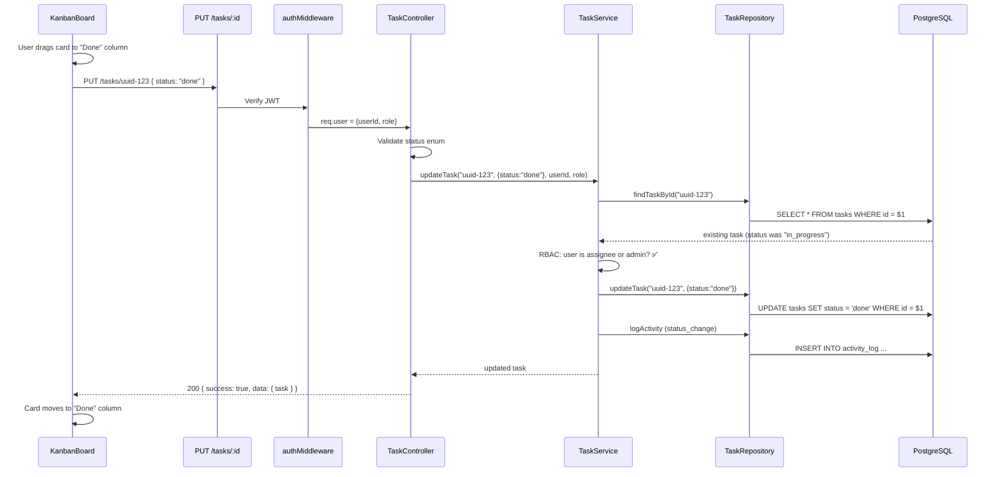
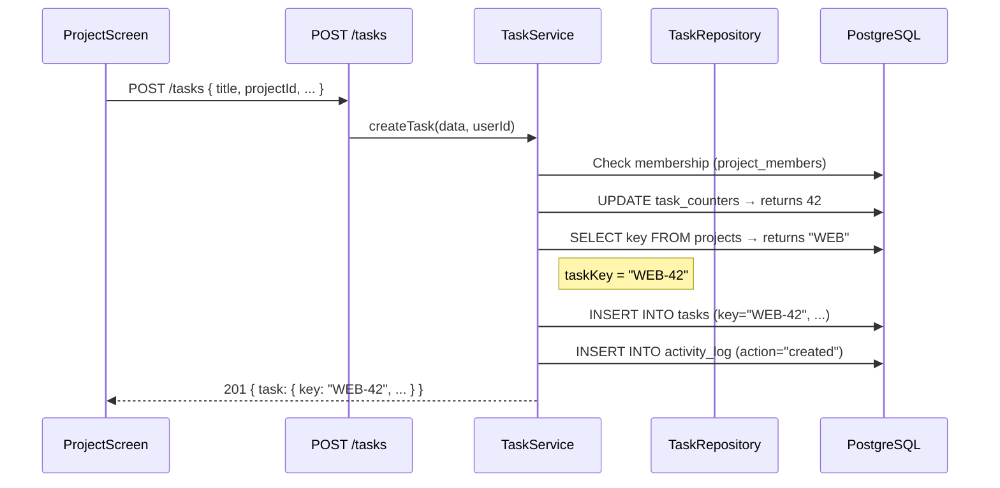

# Tasks API — Complete Documentation

This document covers every task-related REST endpoint. It is derived from the frontend [api.js](file:///Users/cherry/Assignment/frontend/src/services/api.js) service, all screens that consume task data, and the [schema.sql](file:///Users/cherry/Assignment/backend/src/config/schema.sql) database schema.

---

## Route Registration

```
Base path: /api/v1/tasks
```

All task routes require authentication. Register in [app.js](file:///Users/cherry/Assignment/backend/app.js):

```js
import taskRoutes from "./src/routes/taskRoutes.js";
app.use("/api/v1/tasks", taskRoutes);
```

---

## Endpoints Overview

| Method | Path | Auth | Role | Used By (Frontend) |
|--------|------|------|------|-----|
| `GET` | `/api/v1/tasks` | ✅ | Any | Dashboard, MyTasksScreen |
| `GET` | `/api/v1/tasks/:id` | ✅ | Project member | TaskModal (on click) |
| `POST` | `/api/v1/tasks` | ✅ | Any (must be project member) | "Create task" button on ProjectScreen, Dashboard |
| `PUT` | `/api/v1/tasks/:id` | ✅ | Assignee or Admin | TaskModal sidebar edits, Kanban drag-drop |
| `DELETE` | `/api/v1/tasks/:id` | ✅ | **Admin only** | TaskModal "Delete task" button |

---

## Route File — `taskRoutes.js`

```js
import { Router } from "express";
import taskController from "../controllers/taskController.js";
import authMiddleware from "../middlewares/authMiddleware.js";

const router = Router();

router.get("/",       authMiddleware, taskController.getTasks);
router.get("/:id",    authMiddleware, taskController.getTaskById);
router.post("/",      authMiddleware, taskController.createTask);
router.put("/:id",    authMiddleware, taskController.updateTask);
router.delete("/:id", authMiddleware, taskController.deleteTask);

export default router;
```

---

## Frontend → API Mapping

This shows exactly where each API call is triggered in the UI:

| Frontend Action | Screen | API Call |
|---|---|---|
| Page loads → fetch all tasks | [Dashboard.jsx](file:///Users/cherry/Assignment/frontend/src/screens/Dashboard.jsx) | `GET /tasks` |
| Page loads → fetch all tasks | [MyTasksScreen.jsx](file:///Users/cherry/Assignment/frontend/src/screens/MyTasksScreen.jsx) | `GET /tasks` |
| Page loads → fetch project tasks | [ProjectScreen.jsx](file:///Users/cherry/Assignment/frontend/src/screens/ProjectScreen.jsx) (filtered client-side) | `GET /tasks?projectId=xxx` |
| Click task card → open modal | [TaskModal.jsx](file:///Users/cherry/Assignment/frontend/src/screens/TaskModal.jsx) | `GET /tasks/:id` |
| Click "Create task" button | ProjectScreen header, Dashboard header | `POST /tasks` |
| Change status dropdown in modal | TaskModal sidebar | `PUT /tasks/:id` |
| Change assignee dropdown in modal | TaskModal sidebar | `PUT /tasks/:id` |
| Change priority dropdown in modal | TaskModal sidebar | `PUT /tasks/:id` |
| Drag card to different Kanban column | [KanbanBoard](file:///Users/cherry/Assignment/frontend/src/screens/ProjectScreen.jsx#L83) `onDrop` | `PUT /tasks/:id` |
| Edit title inline in modal | TaskModal main area | `PUT /tasks/:id` |
| Click "Delete task" (admin only) | TaskModal footer | `DELETE /tasks/:id` |

---

## 1. GET `/api/v1/tasks` — List Tasks

### Purpose
Returns all tasks the authenticated user has access to. Used by Dashboard (filters to `assignee === currentUser`), MyTasksScreen (same), and ProjectScreen (filters to `projectId`).

### Request

```
GET /api/v1/tasks
GET /api/v1/tasks?projectId=uuid-xxx          (optional filter)
GET /api/v1/tasks?assignee=uuid-xxx           (optional filter)
GET /api/v1/tasks?status=todo,in_progress     (optional filter)
Authorization: Bearer <accessToken>
```

**Query Parameters (all optional):**

| Param | Type | Description |
|-------|------|-------------|
| `projectId` | UUID | Filter tasks by project |
| `assignee` | UUID | Filter tasks by assignee (use `me` for current user) |
| `status` | string (comma-separated) | Filter by status: `todo`, `in_progress`, `done` |
| `priority` | string | Filter by priority: `high`, `medium`, `low` |

### Response

**200 OK**
```json
{
  "success": true,
  "message": "Tasks fetched successfully",
  "data": {
    "tasks": [
      {
        "id": "uuid-task",
        "key": "WEB-12",
        "title": "Refactor pricing page hero",
        "description": "Replace the carousel with a static comparison table...",
        "status": "in_progress",
        "priority": "high",
        "due": "2026-05-25",
        "labels": ["design", "frontend"],
        "projectId": "uuid-project",
        "assignee": "uuid-user",
        "reporterId": "uuid-reporter",
        "createdAt": "2026-05-20T10:00:00.000Z",
        "updatedAt": "2026-05-27T14:30:00.000Z"
      }
    ],
    "count": 17
  }
}
```

> [!NOTE]
> Response field names use **camelCase** (`projectId`, `createdAt`) to match the frontend's existing data shape in [mockData.js](file:///Users/cherry/Assignment/frontend/src/data/mockData.js). The DB uses snake_case (`project_id`, `created_at`) — transform in the repository or service layer.

### SQL Query

```sql
-- Base query — admin sees all tasks in their projects, member sees tasks in their projects
SELECT
    t.id,
    t.key,
    t.title,
    t.description,
    t.status,
    t.priority,
    t.due_date      AS due,
    t.labels,
    t.project_id    AS "projectId",
    t.assignee_id   AS assignee,
    t.reporter_id   AS "reporterId",
    t.created_at    AS "createdAt",
    t.updated_at    AS "updatedAt"
FROM tasks t
JOIN project_members pm ON pm.project_id = t.project_id AND pm.user_id = $1
ORDER BY t.created_at DESC;

-- With optional filters, append WHERE clauses dynamically:
-- AND t.project_id = $2        (if projectId param)
-- AND t.assignee_id = $3       (if assignee param)
-- AND t.status = ANY($4::task_status[])  (if status param)
```

---

## 2. GET `/api/v1/tasks/:id` — Get Single Task

### Purpose
Returns a single task with full details + activity log. Used when the user clicks a task card to open the [TaskModal](file:///Users/cherry/Assignment/frontend/src/screens/TaskModal.jsx).

### Request

```
GET /api/v1/tasks/:id
Authorization: Bearer <accessToken>
```

| Param | Type | In | Description |
|-------|------|----|-------------|
| `id` | UUID | URL path | Task ID |

### Response

**200 OK**
```json
{
  "success": true,
  "message": "Task fetched successfully",
  "data": {
    "task": {
      "id": "uuid-task",
      "key": "WEB-12",
      "title": "Refactor pricing page hero",
      "description": "Replace the carousel with a static comparison table...",
      "status": "in_progress",
      "priority": "high",
      "due": "2026-05-25",
      "labels": ["design", "frontend"],
      "projectId": "uuid-project",
      "assignee": "uuid-user",
      "reporterId": "uuid-reporter",
      "createdAt": "2026-05-20T10:00:00.000Z",
      "updatedAt": "2026-05-27T14:30:00.000Z"
    },
    "activity": [
      {
        "id": "uuid-activity",
        "userId": "uuid-user",
        "userName": "Aanya Mehta",
        "action": "status_change",
        "content": "changed status from To Do to In Progress",
        "details": { "from": "todo", "to": "in_progress" },
        "createdAt": "2026-05-27T12:00:00.000Z"
      },
      {
        "id": "uuid-activity-2",
        "userId": "uuid-user-2",
        "userName": "Marcus Chen",
        "action": "comment",
        "content": "Pulled the new plan IDs from the staging API — let me know if anything looks off.",
        "details": {},
        "createdAt": "2026-05-27T09:00:00.000Z"
      }
    ]
  }
}
```

**404 Not Found**
```json
{
  "success": false,
  "message": "Task not found"
}
```

### SQL Queries

```sql
-- 1. Fetch the task
SELECT
    t.id, t.key, t.title, t.description,
    t.status, t.priority, t.due_date AS due,
    t.labels, t.project_id AS "projectId",
    t.assignee_id AS assignee, t.reporter_id AS "reporterId",
    t.created_at AS "createdAt", t.updated_at AS "updatedAt"
FROM tasks t
WHERE t.id = $1;

-- 2. Fetch activity for this task
SELECT
    a.id, a.user_id AS "userId", u.name AS "userName",
    a.action, a.content, a.details,
    a.created_at AS "createdAt"
FROM activity_log a
JOIN users u ON u.id = a.user_id
WHERE a.task_id = $1
ORDER BY a.created_at DESC;
```

---

## 3. POST `/api/v1/tasks` — Create Task

### Purpose
Creates a new task inside a project. The task key is auto-generated using `task_counters`. The creator is set as the `reporter`. Called when clicking "Create task" on [ProjectScreen](file:///Users/cherry/Assignment/frontend/src/screens/ProjectScreen.jsx#L71) or "New task" on [Dashboard](file:///Users/cherry/Assignment/frontend/src/screens/Dashboard.jsx#L37).

### Request

```
POST /api/v1/tasks
Authorization: Bearer <accessToken>
Content-Type: application/json
```

**Request Body:**
```json
{
  "title": "Refactor pricing page hero",
  "description": "Replace the carousel with a static comparison table.",
  "projectId": "uuid-project-id",
  "assignee": "uuid-user-id",
  "priority": "high",
  "due": "2026-06-01",
  "labels": ["design", "frontend"]
}
```

| Field | Type | Required | Validation |
|-------|------|----------|------------|
| `title` | string | ✅ Yes | 1–255 chars, non-empty |
| `projectId` | UUID | ✅ Yes | Must reference an existing project |
| `description` | string | ❌ No | Max 5000 chars |
| `assignee` | UUID | ❌ No | Must be a member of the target project (if provided) |
| `priority` | string | ❌ No | One of: `high`, `medium`, `low`. Defaults to `medium` |
| `due` | string (YYYY-MM-DD) | ❌ No | Valid date format |
| `labels` | string[] | ❌ No | Array of label strings |
| `status` | string | ❌ No | Defaults to `todo`. One of: `todo`, `in_progress`, `done` |

### Validation Rules (Controller Layer)

```js
// 1. Title required
if (!title || title.trim().length === 0)
    → 400: "Task title is required"

// 2. projectId required and must exist
if (!projectId)
    → 400: "projectId is required"

// 3. Caller must be a member of the project
// (checked in service layer)
    → 403: "You are not a member of this project"

// 4. If assignee provided, must be a project member
    → 400: "Assignee is not a member of this project"

// 5. Priority must be valid enum
if (priority && !['high', 'medium', 'low'].includes(priority))
    → 400: "Invalid priority. Must be high, medium, or low"

// 6. Status must be valid enum
if (status && !['todo', 'in_progress', 'done'].includes(status))
    → 400: "Invalid status. Must be todo, in_progress, or done"
```

### Response

**201 Created**
```json
{
  "success": true,
  "message": "Task created successfully",
  "data": {
    "task": {
      "id": "uuid-new-task",
      "key": "WEB-42",
      "title": "Refactor pricing page hero",
      "description": "Replace the carousel with a static comparison table.",
      "status": "todo",
      "priority": "high",
      "due": "2026-06-01",
      "labels": ["design", "frontend"],
      "projectId": "uuid-project-id",
      "assignee": "uuid-user-id",
      "reporterId": "uuid-current-user",
      "createdAt": "2026-05-28T09:00:00.000Z",
      "updatedAt": "2026-05-28T09:00:00.000Z"
    }
  }
}
```

**400 Bad Request**
```json
{ "success": false, "message": "Task title is required" }
```

**403 Forbidden**
```json
{ "success": false, "message": "You are not a member of this project" }
```

### SQL Queries (in a transaction)

```sql
-- BEGIN

-- 1. Verify user is a project member
SELECT 1 FROM project_members WHERE project_id = $1 AND user_id = $2;
-- If no row → throw 403

-- 2. Get the project key and increment counter
UPDATE task_counters
SET last_number = last_number + 1
WHERE project_id = $1
RETURNING last_number;
-- e.g. returns 42

-- 3. Get the project key prefix
SELECT key FROM projects WHERE id = $1;
-- e.g. returns "WEB"
-- Combine: taskKey = "WEB-42"

-- 4. If assignee provided, verify they are also a project member
SELECT 1 FROM project_members WHERE project_id = $1 AND user_id = $3;
-- If no row → throw 400

-- 5. Insert the task
INSERT INTO tasks (key, title, description, status, priority, due_date, labels, project_id, assignee_id, reporter_id)
VALUES ($1, $2, $3, $4, $5, $6, $7, $8, $9, $10)
RETURNING id, key, title, description, status, priority,
          due_date AS due, labels,
          project_id AS "projectId",
          assignee_id AS assignee,
          reporter_id AS "reporterId",
          created_at AS "createdAt",
          updated_at AS "updatedAt";

-- 6. Log the creation activity
INSERT INTO activity_log (task_id, user_id, action, content)
VALUES ($1, $2, 'created', 'created this task');

-- COMMIT
```

---

## 4. PUT `/api/v1/tasks/:id` — Update Task

### Purpose
Updates one or more fields of a task. This is the most frequently called endpoint — triggered by:
- **Kanban drag-drop** → updates `status` ([KanbanBoard onDrop](file:///Users/cherry/Assignment/frontend/src/screens/ProjectScreen.jsx#L91-L98))
- **Status dropdown** → updates `status` ([TaskModal L93](file:///Users/cherry/Assignment/frontend/src/screens/TaskModal.jsx#L93))
- **Assignee dropdown** → updates `assignee` ([TaskModal L105](file:///Users/cherry/Assignment/frontend/src/screens/TaskModal.jsx#L105))
- **Priority dropdown** → updates `priority` ([TaskModal L116](file:///Users/cherry/Assignment/frontend/src/screens/TaskModal.jsx#L116))
- **Inline title edit** → updates `title` ([TaskModal L49](file:///Users/cherry/Assignment/frontend/src/screens/TaskModal.jsx#L49))

### Request

```
PUT /api/v1/tasks/:id
Authorization: Bearer <accessToken>
Content-Type: application/json
```

**Request Body (partial update — send only changed fields):**
```json
{
  "status": "in_progress"
}
```

Or multiple fields at once:
```json
{
  "title": "Updated title",
  "assignee": "uuid-new-assignee",
  "priority": "low",
  "due": "2026-06-15",
  "labels": ["backend", "api"],
  "description": "Updated description"
}
```

| Field | Type | Required | Validation |
|-------|------|----------|------------|
| `title` | string | ❌ | 1–255 chars if provided |
| `description` | string | ❌ | Max 5000 chars |
| `status` | string | ❌ | `todo`, `in_progress`, or `done` |
| `priority` | string | ❌ | `high`, `medium`, or `low` |
| `assignee` | UUID or `null` | ❌ | Must be a project member if not null |
| `due` | string or `null` | ❌ | `YYYY-MM-DD` or null to clear |
| `labels` | string[] | ❌ | Array of strings |

### RBAC Rules

| Who | What they can update |
|-----|---------------------|
| **Admin** | Any field on any task in any of their projects |
| **Member (assignee)** | `status`, `description` on tasks assigned to them |
| **Member (non-assignee)** | ❌ Cannot update (403) |

### Response

**200 OK**
```json
{
  "success": true,
  "message": "Task updated successfully",
  "data": {
    "task": {
      "id": "uuid-task",
      "key": "WEB-12",
      "title": "Refactor pricing page hero",
      "status": "in_progress",
      "priority": "high",
      "due": "2026-05-25",
      "labels": ["design", "frontend"],
      "projectId": "uuid-project",
      "assignee": "uuid-user",
      "reporterId": "uuid-reporter",
      "createdAt": "2026-05-20T10:00:00.000Z",
      "updatedAt": "2026-05-28T09:15:00.000Z"
    }
  }
}
```

**403 Forbidden**
```json
{ "success": false, "message": "You are not authorized to update this task" }
```

**404 Not Found**
```json
{ "success": false, "message": "Task not found" }
```

### SQL Queries

```sql
-- 1. Fetch the existing task (to check ownership and detect changes)
SELECT * FROM tasks WHERE id = $1;

-- 2. Build dynamic UPDATE (only changed fields)
UPDATE tasks
SET
    title = COALESCE($2, title),
    description = COALESCE($3, description),
    status = COALESCE($4, status),
    priority = COALESCE($5, priority),
    due_date = $6,          -- nullable, so direct set
    labels = COALESCE($7, labels),
    assignee_id = $8        -- nullable, so direct set
WHERE id = $1
RETURNING id, key, title, description, status, priority,
          due_date AS due, labels,
          project_id AS "projectId",
          assignee_id AS assignee,
          reporter_id AS "reporterId",
          created_at AS "createdAt",
          updated_at AS "updatedAt";

-- 3. Log the activity (if status changed)
INSERT INTO activity_log (task_id, user_id, action, content, details)
VALUES ($1, $2, 'status_change',
        'changed status from To Do to In Progress',
        '{"from": "todo", "to": "in_progress"}'::jsonb);

-- 4. Log the activity (if assignee changed)
INSERT INTO activity_log (task_id, user_id, action, content, details)
VALUES ($1, $2, 'assignee_change',
        'assigned to Rohan Iyer',
        '{"from": "uuid-old", "to": "uuid-new"}'::jsonb);
```

> [!TIP]
> For the Kanban drag-drop, the frontend only sends `{ "status": "done" }`. Keep the update endpoint flexible — only update fields that are present in the request body.

---

## 5. DELETE `/api/v1/tasks/:id` — Delete Task

### Purpose
Permanently deletes a task. **Admin only.** Triggered by the red "Delete task" button at the bottom of the [TaskModal](file:///Users/cherry/Assignment/frontend/src/screens/TaskModal.jsx#L147-L151) sidebar, which is conditionally rendered with `{isAdmin && ...}`.

### Request

```
DELETE /api/v1/tasks/:id
Authorization: Bearer <accessToken>
```

| Param | Type | In | Description |
|-------|------|----|-------------|
| `id` | UUID | URL path | Task ID to delete |

### RBAC

- **Admin**: ✅ Can delete any task
- **Member**: ❌ 403 Forbidden

### Response

**200 OK**
```json
{
  "success": true,
  "message": "Task deleted successfully"
}
```

**403 Forbidden**
```json
{ "success": false, "message": "Only admins can delete tasks" }
```

**404 Not Found**
```json
{ "success": false, "message": "Task not found" }
```

### SQL Queries

```sql
-- 1. Check task exists
SELECT id, project_id FROM tasks WHERE id = $1;

-- 2. Delete (CASCADE removes related activity_log rows automatically)
DELETE FROM tasks WHERE id = $1;
```

---

## Architecture Layers

Following the same pattern as your auth and project controllers:

### Controller (`taskController.js`)

```
Responsibilities: Parse req, validate input, call service, format res.
Pattern: Class with arrow-function methods, exported as singleton.
```

```js
import TaskService from '../services/taskService.js';
import { AppError } from '../utils/AppError.js';

class TaskController {
    constructor() {
        this.taskService = new TaskService();
    }

    getTasks     = async (req, res) => { /* ... */ };
    getTaskById  = async (req, res) => { /* ... */ };
    createTask   = async (req, res) => { /* ... */ };
    updateTask   = async (req, res) => { /* ... */ };
    deleteTask   = async (req, res) => { /* ... */ };
}

export default new TaskController();
```

---

### Service (`taskService.js`)

```
Responsibilities: Business logic, RBAC checks, orchestrate repository calls.
```

| Method | Logic |
|--------|-------|
| `getAllTasks(userId, role, filters)` | Fetch tasks user has access to, apply optional filters |
| `getTaskById(taskId, userId)` | Fetch single task + activity log, verify access |
| `createTask(data, userId)` | Verify membership → generate key → INSERT task → log activity |
| `updateTask(taskId, patch, userId, role)` | Verify ownership/admin → UPDATE → log changes |
| `deleteTask(taskId, userId, role)` | Verify admin role → DELETE |

---

### Repository (`taskRepo.js`)

```
Responsibilities: Raw SQL only. No business logic.
```

| Method | SQL |
|--------|-----|
| `findAllTasks()` | `SELECT ... FROM tasks ORDER BY created_at DESC` |
| `findTasksByUserId(userId)` | `SELECT ... JOIN project_members ...` |
| `findTaskById(id)` | `SELECT ... WHERE id = $1` |
| `findTasksByProject(projectId)` | `SELECT ... WHERE project_id = $1` |
| `createTask(data)` | `INSERT INTO tasks ... RETURNING *` |
| `updateTask(id, fields)` | Dynamic `UPDATE tasks SET ... WHERE id = $1 RETURNING *` |
| `deleteTask(id)` | `DELETE FROM tasks WHERE id = $1` |
| `getNextTaskNumber(projectId)` | `UPDATE task_counters SET last_number = last_number + 1 ... RETURNING last_number` |
| `getTaskActivity(taskId)` | `SELECT ... FROM activity_log WHERE task_id = $1` |
| `logActivity(data)` | `INSERT INTO activity_log ...` |

---

## Data Flow Diagrams

### Kanban Drag-Drop (Most Common)



### Task Creation



---

## Error Codes Summary

| Code | Endpoint | When | Message |
|------|----------|------|---------|
| `200` | GET, PUT | Success | "Tasks fetched successfully" / "Task updated successfully" |
| `201` | POST | Created | "Task created successfully" |
| `400` | POST, PUT | Missing/invalid fields | "Task title is required" / "Invalid priority" / "Assignee is not a member of this project" |
| `401` | All | No token / expired | "Access denied." |
| `403` | PUT | Non-assignee member tries to update | "You are not authorized to update this task" |
| `403` | DELETE | Member tries to delete | "Only admins can delete tasks" |
| `403` | POST | User not a member of the project | "You are not a member of this project" |
| `404` | GET/:id, PUT, DELETE | Task ID doesn't exist | "Task not found" |
| `500` | All | Unexpected error | "Internal server error" |

---

## Frontend ↔ Backend Field Mapping

| Frontend field (used in JSX) | API Response field | DB Column | Notes |
|---|---|---|---|
| `t.id` | `task.id` | `tasks.id` | UUID |
| `t.key` | `task.key` | `tasks.key` | Auto-generated `WEB-12` |
| `t.title` | `task.title` | `tasks.title` | Editable in modal |
| `t.description` | `task.description` | `tasks.description` | Textarea in modal |
| `t.status` | `task.status` | `tasks.status` | `todo` / `in_progress` / `done` |
| `t.priority` | `task.priority` | `tasks.priority` | `high` / `medium` / `low` |
| `t.due` | `task.due` | `tasks.due_date` | ⚠️ DB is `due_date`, API returns `due` |
| `t.labels` | `task.labels` | `tasks.labels` | Postgres TEXT[] array |
| `t.projectId` | `task.projectId` | `tasks.project_id` | ⚠️ Snake→camel conversion |
| `t.assignee` | `task.assignee` | `tasks.assignee_id` | ⚠️ DB is `assignee_id`, API returns `assignee` |
| `t.created_at` | `task.createdAt` | `tasks.created_at` | ISO timestamp |
| `t.updated_at` | `task.updatedAt` | `tasks.updated_at` | ISO timestamp |

> [!WARNING]
> Pay special attention to the **column aliasing** in your SQL queries. The frontend expects `due`, `assignee`, `projectId` (camelCase) — but the DB stores `due_date`, `assignee_id`, `project_id` (snake_case). Use SQL `AS` aliases consistently.
